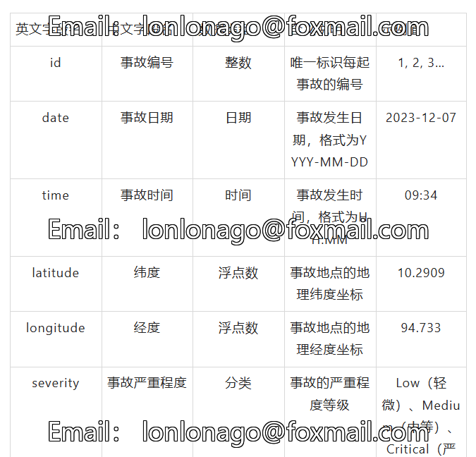
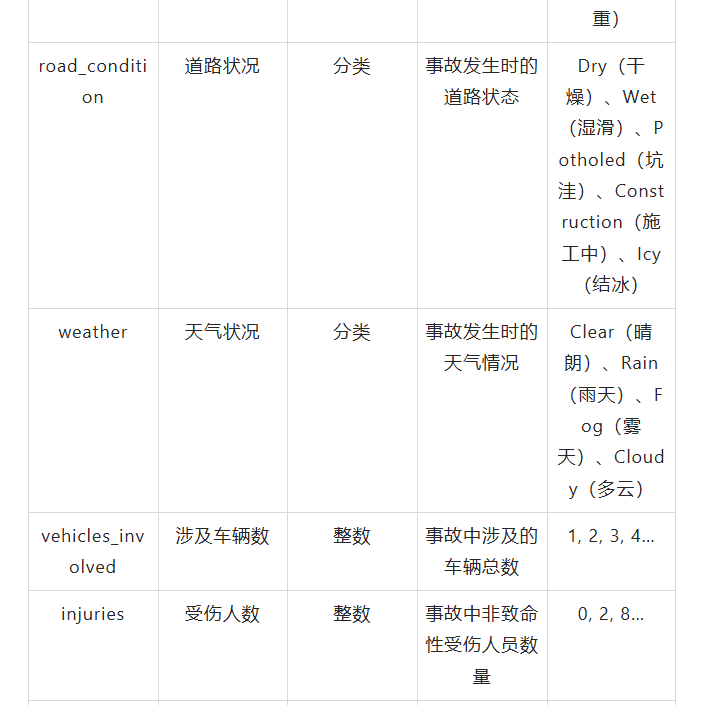
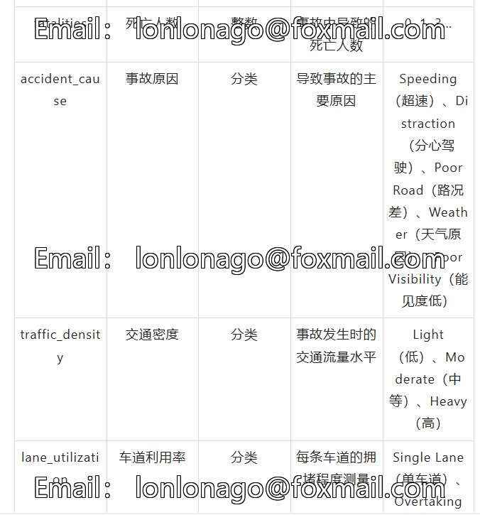
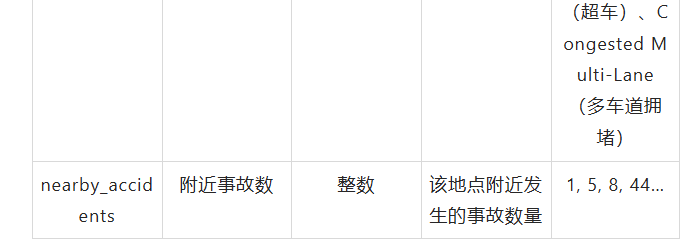

# 100,000 Records CSV File - India Traffic Accident Analysis Dataset.7z

Introduction to the "India Traffic Accident Analysis" Dataset: This comprehensive dataset, specifically created for research on "Traffic Accident Analysis," contains 100,000 (1 lakh) authentic 
traffic accident records. The data structure closely resembles that of real-world traffic accident datasets.

This dataset covers detailed information about traffic accidents in India, providing a rich data foundation for traffic safety studies, accident prediction, and the formulation of prevention 
strategies.

Field Explanation:
• Data Size: 1,000,000 accident records
• Time Span: From 2020 to 2023
• Geographic Range: India
• Data Completeness: Includes multi-dimensional information such as time, space, environmental conditions, people involved, and causes of accidents.

Application Scenarios:
1. Traffic Accident Prediction Analysis: Use machine learning algorithms to predict the probability of accidents occurring at specific times, places, and weather conditions. Establish an early 
warning system to identify high-risk areas and periods.
2. Traffic Safety Assessment: Analyze the impact of different road conditions and weather conditions on the severity of accidents. Evaluate the level of traffic safety in specific regions or roads. 
Identify high-incidence sections and dangerous driving patterns.
3. Traffic Management and Planning: Optimize traffic signal timings and road designs. Develop targeted traffic management measures and speed limits. Support urban traffic planning with data.
4. Cause Analysis of Traffic Accidents: Investigate the correlation between accident causes and factors like weather, road conditions, and traffic density. Analyze the casualties caused by different 
accident causes. Identify the main causes and their impact.
5. Spatiotemporal Pattern Analysis: Analyze the distribution pattern of accidents over time (season, month, hour) and spatially (cluster characteristics). Discover accident hotspots and periodic 
trends.
6. Emergency Response Optimization: Based on accident severity and location optimize rescue resource allocation. Predict the impact of accidents on surrounding traffic. Improve emergency department 
response efficiency and rescue capabilities.
7. Policy Development and Effectiveness Evaluation: Provide scientific evidence for the formulation of traffic safety regulations. Evaluate the effectiveness of traffic safety improvement measures. 
Support insurance industry risk assessment and pricing strategies.

Data Use Recommendations:
1. Data Preprocessing: It is recommended to perform data cleaning before use, dealing with missing values and outliers.
2. Feature Engineering: Derive derived features from the date and time fields such as weekdays, months, hours, etc.
3. Spatial Analysis: Integrate with Geographic Information Systems (GIS) for visualization analysis.
4. Model Selection: Suitable for classification, regression, clustering, and other machine learning tasks.
5. Business Understanding: It is advised to conduct in-depth analysis based on practical traffic management knowledge.

Note: This dataset is simulated, but its structure and distribution are highly similar to real-world data. When conducting academic research or commercial applications, please be aware of compliance 
with data usage regulations. It is recommended to combine this dataset with other related datasets, such as road infrastructure data and population statistics.

Dataset Source: This dataset comes from traffic accident data in India, provided by government departments, research institutions, and industry experts. The original author did not specify the source 
of the dataset, which can be found at https://www.kaggle.com/datasets/allupranathi/traffic-accident-analysis-dataset for further study and research.

## Images

Here is a pay link on Stripe ( https://buy.stripe.com/3cs8yP7sY87d0vu9AB ). Please contact me lonlonago@foxmail.com after funding $89, and I will send you a complete data files , thank you!

